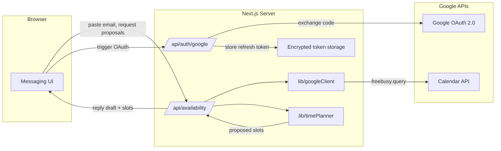

# Calendary AI — Messaging-First Meeting Assistant

Calendary AI is a minimal web demo that ingests a meeting-request email, inspects your Google Calendar availability, proposes 2–3 meeting options, and drafts a reply. The entire flow is designed with privacy guardrails so raw email/calendar data stays local.

## Demo Overview

- **Frontend**: Next.js (App Router) with a messaging-style interface leveraging Mantine and MUI components.
- **Backend**: Next.js API routes handle Google OAuth, calendar free/busy queries, and time-slot planning logic.
- **Auth**: Google OAuth 2.0 installed-app/web flow using official Google APIs.
- **Privacy**: Email text and calendar data processed locally; refresh tokens stored encrypted, and no event bodies leave the server.

## Getting Started

1. **Install dependencies**
   ```bash
   npm install
   ```

2. **Google Cloud setup**
   - Create a Google Cloud project.
   - Enable the Calendar API.
   - Configure OAuth consent (internal/testing) and create OAuth client credentials (web application).
   - Set authorized origins/redirects:
     - Origin: `http://localhost:3000`
     - Redirect: `http://localhost:3000/api/auth/google`
   - Download the client secret JSON and place it at `config/google-client-secret.json` (never commit).

3. **Environment variables** — create `.env.local`:
   ```bash
   GOOGLE_CLIENT_ID=your-client-id
   GOOGLE_CLIENT_SECRET=your-client-secret
   NEXTAUTH_SECRET=generate-a-long-random-string
   GOOGLE_REDIRECT_URI=http://localhost:3000/api/auth/google/callback
   TOKEN_STORAGE_PATH=./data/tokens
   ```

4. **Run the dev server**
   ```bash
   npm run dev
   ```
   Open `http://localhost:3000`, connect Google Calendar, paste a meeting request, and generate reply proposals.

## Architecture Overview



### Components

- `app/page.tsx`: Messaging interface.
- `app/api/auth/google/*`: OAuth initiation and callback handlers.
- `app/api/availability/route.ts`: Core API to parse email context, query calendar availability, and produce proposals.
- `lib/googleClient.ts`: Wraps Google API client construction and token management.
- `lib/timePlanner.ts`: Time-slot recommendation engine with business-hour logic.
- `lib/emailParser.ts`: (Planned) Extracts requested dates, attendees, constraints from raw email text.

## Data Flow & Privacy Model

- **Email input** stays client-side until submission; server receives over HTTPS (local). After response generation, the payload isn’t persisted.
- **Calendar data** fetched via `freebusy.query` returns only busy intervals (start/end). Event subjects/attendees are never requested or stored.
- **Token storage**: Refresh tokens encrypted at `TOKEN_STORAGE_PATH`. Recommend file permissions (600) or macOS Keychain integration.
- **Logging**: Do not log raw email or calendar data. Use redacted logging for debugging.
- **Third-party services**: Only Google OAuth/Calendar APIs by default. Optional Gemini integration is opt-in and disclosed to the user. Microsoft Graph support is planned but not yet implemented.

### Privacy Guardrails

- Keep raw email/calendar content local; if future deployments require remote processing, document and redact aggressively.
- Provide transparency via an optional “What I can see and why” panel (nice-to-have).
- Offer instructions for revoking access tokens (Google Account → Security → Third-party access).
- When users opt-in to the Gemini reply feature, clearly disclose that email text and slot summaries are sent to Google’s Gemini API and retained per Google’s terms.

### Assumptions & Trade-offs

- The MVP targets a single Google Calendar account authenticated via OAuth 2.0 and uses only official Google APIs (`calendar.readonly` scope). Support for Microsoft Graph is on the roadmap but not yet wired in.
- All processing happens on the user’s machine/server instance. Optional Gemini drafting sends email content and slot summaries to Google; users must explicitly opt in and can fall back to the local draft at any time.
- Time proposals rely on heuristic business hours (9–5) and 15-minute increments; more advanced logic (participant availability, buffer times) can be layered on later.
- Tokens and prompts are stored locally (filesystem by default). For multi-user deployments, plan to migrate to a hardened secret store or keychain.

## OAuth Scopes

| Scope | Reason |
| --- | --- |
| `https://www.googleapis.com/auth/calendar.readonly` | Needed for `freebusy.query` to read availability without modifying events. |

Future functionality (e.g., creating holds) would require `https://www.googleapis.com/auth/calendar.events`. Document any scope changes in the README and consent screen.

## Storage Choices

- `config/google-client-secret.json`: Developer-provided OAuth credentials (gitignored).
- `./data/tokens`: Encrypted JSON tokens keyed by user session. For production, migrate to OS keychain or managed secret store.

## Demo Flow

1. User opens the messaging UI.
2. If not authorized, they connect Google Calendar (OAuth flow).
3. User pastes meeting-request email and selects duration.
4. Backend queries calendar free/busy window.
5. `timePlanner` proposes 2–3 viable slots respecting constraints.
6. Backend drafts reply text referencing the suggestions.
7. UI displays summary, slot list, and reply draft for copy/send.

## Planned Webhook Handling

See `docs/webhooks.md` (to be authored) for calendar/email webhook design: subscription endpoints, security validation, and data minimization.

## Optional Gemini Integration

Calendary can optionally call Google’s Gemini 2.x models to draft the email reply and refine slot suggestions. The feature is off by default and requires:

1. **Env configuration**: add to `.env.local`
   ```bash
   GEMINI_API_KEY=your-gemini-api-key
   GEMINI_MODEL=gemini-2.5-flash-latest
   GEMINI_FEATURE_ENABLED=true
   ```
2. **User consent**: the UI surfaces a disclosure modal explaining that email content and proposed slots will be sent to Google’s Gemini API and are retained per Google’s policy (up to 30 days for abuse prevention). Consent is stored in a cookie and can be reset by disconnecting.
3. **Opt-out**: leave `GEMINI_FEATURE_ENABLED` unset/false to remove the Gemini button.

**Privacy considerations**
- Email text and slot suggestions are transmitted to Google when Gemini is used; they should contain no regulated or highly sensitive data.
- Responses are processed in-memory; we do not persist Gemini responses beyond the returned reply.
- Update documentation and consent copy if you change models or data handling behavior.
